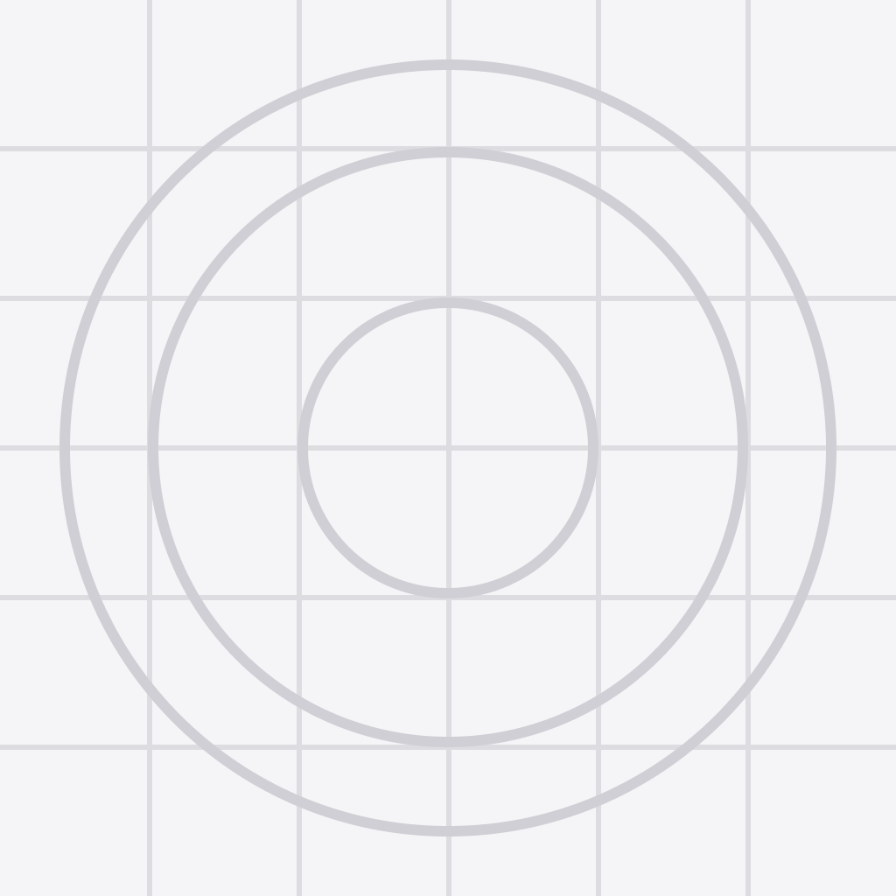

<div align="center">
  

  # 🩺 Medikidney App
  
  **A comprehensive mobile application designed to streamline the clinical workflow for dialysis nurses and patient management.**

  [](https://reactnative.dev/)
  [](https://expo.dev/)
  [](https://developer.mozilla.org/en-US/docs/Web/JavaScript)
</div>

---

## 📖 About The Project

**Medikidney** is a specialized mobile application built as a graduation project. It provides an optimized clinical workflow for dialysis centers, allowing nurses to efficiently monitor patients, track vital signs, administer medications, and manage dialysis sessions in real-time.

### ✨ Key Features

- 👥 **Patient Management Workflow:** Nurses can select patients from a list and transition them to an active monitoring state during their shift.
- 🏥 **Dialysis Session Monitoring:** Dedicated tabs for **Medications**, **Vital Signs**, **Settings**, and **Symptoms** during active sessions.
- 📊 **Real-time Data Persistence:** Seamless integration with backend APIs to ensure all patient data and session records are securely stored and updated.
- 📱 **Cross-Platform:** Built with React Native and Expo, providing a consistent experience on both Android and iOS devices.
- 🔔 **Notifications & Alerts:** Smart notifications integrated for timely updates during patient care.
- 🌍 **Localization:** Multi-language support using robust translation setups.

---

## 🛠️ Tech Stack

- **Framework:** [React Native](https://reactnative.dev/) (v0.83.6)
- **Toolchain:** [Expo](https://expo.dev/) (SDK 55)
- **Navigation:** [React Navigation](https://reactnavigation.org/) (Bottom Tabs, Native Stack, Material Top Tabs)
- **UI Components:** [@rneui/themed](https://reactnativeelements.com/) (React Native Elements)
- **Network:** [Axios](https://axios-http.com/)
- **Storage:** AsyncStorage
- **Form Validation:** Yup

---

## 📂 Project Structure

```text
medikidney_App/
├── AppNavigation/       # Navigation configuration and routers
├── assets/              # Static assets (images, fonts)
├── components/          # Reusable UI components
├── constants/           # App-wide constants (colors, theme)
├── context/             # React Context API for state management
├── hooks/               # Custom React hooks (e.g., useNotifications)
├── screens/             # Main application screens (NurseTasks, MedicationsTab, etc.)
├── services/            # API integration and external services
├── translations/        # i18n localization files
├── utils/               # Helper functions and utilities
└── App.js               # Application entry point
```

---

## 🚀 Getting Started

Follow these instructions to get a copy of the project up and running on your local machine.

### Prerequisites

- Node.js (v18 or higher recommended)
- npm or yarn
- Expo CLI (`npm install -g expo-cli`)
- Expo Go app on your physical device OR an Emulator (Android Studio / Xcode)

### Installation

1. **Clone the repository:**
   ```bash
   git clone https://github.com/ibraheemjawabreh/Medikidney.git
   cd medikidney_App
   ```

2. **Install dependencies:**
   ```bash
   npm install
   ```

3. **Start the development server:**
   ```bash
   npx expo start
   ```

4. **Run on Device/Emulator:**
   - Press `a` to run on Android emulator.
   - Press `i` to run on iOS simulator.
   - Or scan the QR code displayed in the terminal using the **Expo Go** app on your phone.

---

## 📸 Screenshots

*(Add your app screenshots here by uploading them to an `assets/screenshots` folder and linking them)*

||||
|:---:|:---:|:---:|
| **Patient List** | **Active Session** | **Vital Signs** |

---

## 🤝 Contributing

Contributions, issues, and feature requests are welcome!

---

## 📝 License

This project is licensed under the MIT License.
